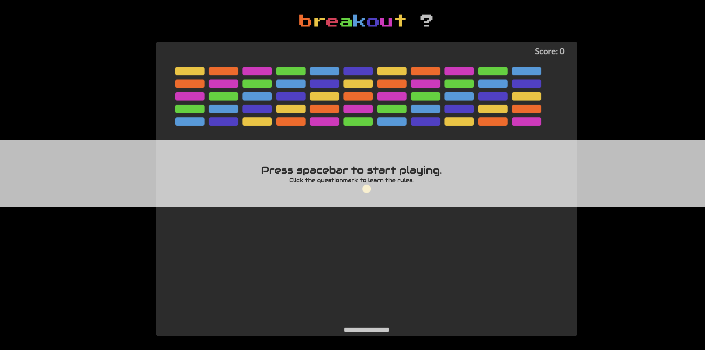

# breakout

:space_invader: Atari Breakout game remade with HTML5 Canvas API.

**Demo:** https://cakebatterandsprinkles.github.io/breakout

## Rules:

Pressing the spacebar will start the game.
To see the rules, click on the questionmark.
Use your right and left keys to move the paddle to bounce the ball up and break the blocks. The paddle size and ball speed will change randomly. If you miss the ball, your score and blocks will reset.

## Attribution:

8-bit music playing at the background is from [this link](https://www.youtube.com/watch?v=XEMQ-kj2nlo) and apparently has no copyright. Also it's very addictive.

(>'-')> Have fun, be good.
